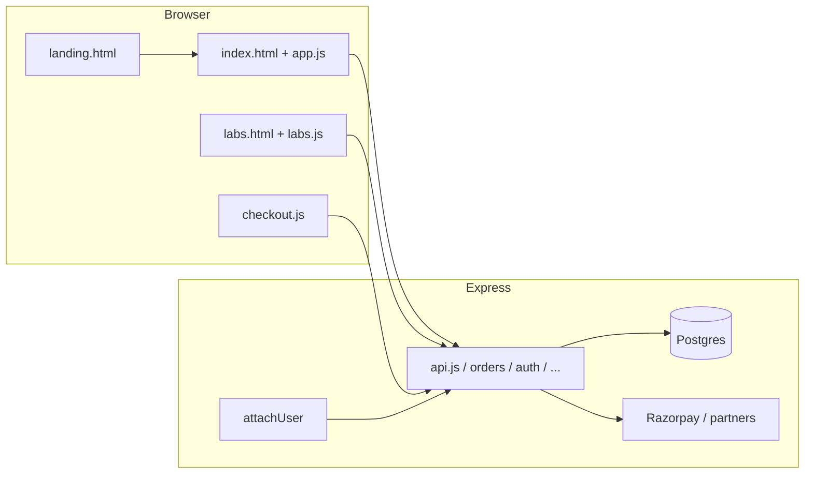

# PaxMed user journey — code-level flow (debug-oriented)

This document maps **what the user does** to **which files and HTTP endpoints run**, so you can trace behavior like a debugger: follow the URL → static page → JS entry → `fetch()` → Express route → DB/partner.

---

## 1. Request pipeline (every HTTP hit)

```text
Browser
  → Express `server/index.js`
      → cookieParser
      → attachUser (server/auth/middleware.js)   // reads `sid` cookie → Redis (partner) or Postgres `sessions` → sets `req.user` or leaves unset
      → route handlers / static files / fallback
```

**Debug checkpoints**

| What to inspect | Where |
|-----------------|--------|
| Session present? | `req.user` in route handlers; cookie name `sid` in DevTools → Application → Cookies |
| Redis down | Logs show `ECONNREFUSED` to `:6379`; consumer sessions still work via Postgres `sessions` |
| 401 from API | `requireUser` in route; client should redirect to `/login.html` |

---

## 2. Page entry (static HTML)

| User intent | URL (path) | File served | Main client JS |
|-------------|------------|-------------|----------------|
| Marketing home | `GET /` | `public/landing.html` | — (mostly static; `public/landing.css`) |
| Medicine compare | `GET /index.html` or `GET /*` (SPA fallback) | `public/index.html` | `public/app.js` |
| Diagnostics | `/labs.html` | `public/labs.html` | `public/labs.js` |
| Cart | `/cart.html` | `public/cart.html` | (cart helpers + `public/cartStore.js`) |
| Checkout | `/checkout.html` | `public/checkout.html` | `public/checkout.js` |
| Login / OTP | `/login.html` | `public/login.html` | `public/login.js` |
| Orders list | `/orders.html` | `public/orders.html` | app-specific scripts |
| Order detail | `/order.html?id=…` | `public/order.html` | `public/order.js` |
| Profile shell | `/profile.html` | `public/profile.html` | `public/authProfile.js` + iframes |

**Server rules** (`server/index.js`)

- `GET /` → **only** `landing.html` (not `index.html`).
- `express.static('public', { index: false })` so `/` does not auto-serve `index.html`.
- `GET *` (non-file) → `index.html` (catch-all for deep links to the **medicines** SPA shell).

**Debug**

- Wrong page on `/` → confirm Node is the process bound to the port (not a CDN serving old `index.html` only).
- Logo links in headers point to `/landing.html` across pages.

---

## 3. Journey A — Landing → medicines search

1. **User** opens `/` → sees `landing.html`.
2. **User** clicks “Start comparing prices” (or `/index.html` from nav) → `public/index.html` loads.
3. **`public/app.js`** initializes search UI, location, suggestions.
4. **Typical API calls** (via `fetch` in `app.js`):

   | Action | Method + path | Route file |
   |--------|----------------|------------|
   | Autocomplete | `GET /api/medicines/search?q=…` | `server/routes/api.js` |
   | Normalize query | `GET /api/normalize?q=…` | `server/routes/api.js` |
   | Local + catalog compare | `GET /api/…` (compare bundle; see `/api` router) | `server/routes/api.js` |
   | Online compare | `GET /api/online/compare?…` | `server/routes/onlineCompare.js` |
   | Reverse geocode | `GET /api/geocode/reverse?…` | `server/routes/geocode.js` |

5. **DB** access goes through `server/db/pool.js` (`DATABASE_URL`).

**Debug**

- Network tab: filter `Fetch/XHR`, watch status `200` vs `401` vs `503`.
- `/api/health` → `server/routes/api.js` `GET /health` (DB ping).
- Suggestions empty → DB seed / `search_vector` / query length limits in `api.js`.

---

## 4. Journey B — Prescription OCR (medicines)

1. User uploads image on index → `POST /api/prescription/ocr` (multipart `file`).
2. **Server**: `server/ocr/ocr.js` → `server/prescription/parse.js` → returns matched medicines.

**Debug**

- 400 “Missing file” → field name must be `file` (see `multer` in `api.js`).

---

## 5. Journey C — Cart → checkout → order

1. **Client** stores lines in **browser storage** (`public/cartStore.js`; keys often `paxmed_*`).
2. User opens **`/checkout.html`** → **`public/checkout.js`**:
   - Ensures login via `/api/auth/me` or redirects to `login.html`.
   - Builds payload → **`POST /api/orders`** (medicine / COD or prepaid path).
3. **Prepaid**: Razorpay client flow → **`/api/payments/razorpay/...`** (`server/routes/paymentsRazorpay.js`); webhook → `/webhook/razorpay` (raw body).
4. **Success** → redirect to **`/order.html`** or orders list; partner WhatsApp / DB writes inside `server/routes/orders.js`.

**Debug**

- 401 on `POST /api/orders` → session missing/expired; check `sid` and `attachUser`.
- COD rules → `totalPaise` validation in `server/routes/orders.js`.
- Diagnostics COD → phone normalization `toPartnerCallingNumber` in `server/integrations/diagnosticsPartner.js`.

---

## 6. Journey D — Auth (OTP / password / Google)

| Step | Client | API |
|------|--------|-----|
| Request OTP | `login.js` | `POST /api/auth/request-otp` |
| Verify OTP | `login.js` | `POST /api/auth/verify-otp` |
| Password login | `login.js` | `POST /api/auth/login` |
| Session check | any page | `GET /api/auth/me` |
| Logout | UI | `POST /api/auth/logout` |
| Google OAuth | redirect | `GET /api/auth/google/start` → callback |

**Implementation**: `server/routes/auth.js`; sessions in **Postgres** `sessions` + `users`; cookie **httpOnly** `sid` (details in auth route).

**Debug**

- `GET /api/auth/me` returns user object or 401.
- `returnTo` query on login page (see `login.js` `postLoginDestination`).

---

## 7. Journey E — Diagnostics (labs)

1. **`/labs.html`** + **`public/labs.js`**:
   - City, test search, partner search → `GET /api/labs/tests/suggest`, `/api/labs/intent`, partner search helpers in `api.js` / `diagnosticsPartner.js`.
   - Compare/add to cart → cart store → checkout path for **diagnostics** booking.
2. **Book order**: **`POST /api/orders/diagnostics`** (`server/routes/orders.js`) → partner API (`server/integrations/diagnosticsPartner.js`).
3. **Webhook** (partner callbacks): `POST /webhook/diagnostics` → `server/routes/diagnosticsWebhook.js`.
4. **Reports**: `server/routes/diagnosticReports.js` under `/api/diagnostic-reports`.

**Debug**

- City slug required for several lab routes (`normalizeCitySlug` in `api.js`).
- Partner disabled → env + `isDiagnosticsPartnerEnabled`.

---

## 8. Journey F — Profile, ABHA, prescriptions

| Area | HTML / JS entry | API prefix |
|------|------------------|------------|
| Profile data | `profile.html`, embeds | `/api/profile/*` (`server/routes/profile.js`) |
| ABHA | `profile-page-abha.html`, `profile-page-abha.js` | `/api/abha/*` (`server/routes/abha.js`) |
| Prescriptions list/upload | profile RX pages | `/api/prescriptions/*` (`server/routes/prescriptions.js`) |

Most **mutations** use `POST` + `requireUser` → 401 if not logged in.

---

## 9. “Debug mode” checklist (practical)

1. **One browser profile** + DevTools **Preserve log** on Network.
2. **Confirm server**: `GET /` body contains `landing-body` (marketing), `GET /index.html` contains `id="q"` (search box).
3. **API base** is same-origin (`/api/...`) — no CORS for static pages.
4. **Trace a failing click**: Elements → select button → find listener → source file line → read the `fetch` URL → open **server route file** and search the path string.
5. **DB**: if `/api/health` is `503`, fix `DATABASE_URL` / Postgres.
6. **Redis**: optional for provider sessions; consumer flow uses Postgres if Redis fails.

---

## 10. Diagram (high level)



---

*Generated for PaxMed codebase layout; adjust route names if you add new routers under `server/routes/`.*
